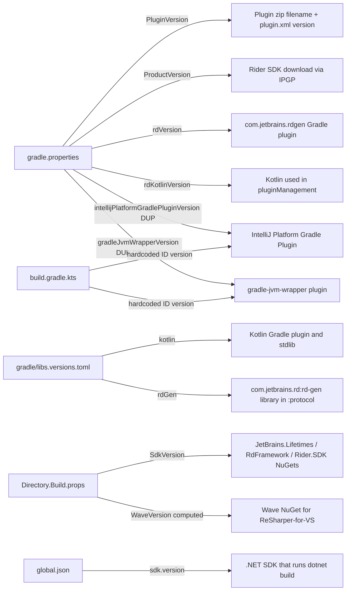

# 07 · Version-pinning map

**[This Project]** — *This is the most-consulted page in the wiki. Bookmark it.*

Versions in this build live in **four files**, in **four different formats**, and several of them are duplicated. Bumping a single thing (e.g. Rider SDK 2026.1 → 2026.2) requires editing multiple places. This page is the canonical map.

## The full table

| Property | File | Line | Current | Drives |
|---|---|---|---|---|
| **Gradle wrapper** | `gradle/wrapper/gradle-wrapper.properties` | 3 | 9.4.1 | the Gradle build itself |
| **Gradle wrapper** *(duplicate)* | `build.gradle.kts` | 58 | 9.4.1 | regenerated on `./gradlew wrapper` |
| **JDK** | `build.gradle.kts` | 14-20 | 21 | Java toolchain (auto-provisioned) |
| **JVM target** *(redundant)* | `build.gradle.kts` | 82-84 | 21 | Kotlin compiler output |
| **JDK** *(stale)* | `.run/Build Plugin.run.xml` | 8 | corretto-17.0.7 | should be 21 — drift |
| **Kotlin** | `gradle/libs.versions.toml` | 2 | 2.3.20 | frontend Kotlin compiler |
| **`rdKotlinVersion`** | `gradle.properties` | 25 | 2.3.0 | Kotlin used by `pluginManagement` for rdgen plugin resolution |
| **`rdGen`** (library) | `gradle/libs.versions.toml` | 3 | 2026.1.3 | `com.jetbrains.rd:rd-gen` library inside `:protocol` |
| **`rdVersion`** (plugin) | `gradle.properties` | 24 | 2026.1 | the `com.jetbrains.rdgen` Gradle *plugin* |
| **IPGP** | `gradle.properties` | 26 | 2.14.0 | `intellijPlatformGradlePluginVersion` consumed by `pluginManagement` |
| **IPGP** *(duplicate, drifted)* | `build.gradle.kts` | 9 | 2.14.0 | the actually-applied plugin version |
| **`gradleJvmWrapperVersion`** | `gradle.properties` | 27 | 0.15.0 | `me.filippov.gradle.jvm.wrapper` plugin via `pluginManagement` |
| **`gradleJvmWrapperVersion`** *(duplicate, DRIFTED)* | `build.gradle.kts` | 10 | 0.16.0 | the actually-applied plugin version |
| **`ProductVersion`** | `gradle.properties` | 17 | 2026.1 | which Rider IDE artifact IPGP downloads |
| **`SdkVersion`** | `Directory.Build.props` | 4 | 2026.1.* | `JetBrains.Rider.SDK` / `Lifetimes` / `RdFramework` NuGet versions |
| **`WaveVersion`** *(computed)* | `Directory.Build.props` | 33-35 | 261.0.0* | `Wave` NuGet package (ReSharper compat) |
| **`PluginVersion`** | `gradle.properties` | 7 | 2025.1.10 | plugin marketplace release version |
| **.NET SDK** | `global.json` | — | 7.0.202 (rollForward latestMajor) | `dotnet build` |
| **`riderBaseVersion`** | `gradle.properties` | 28 | 2025.1 | **DEAD** — zero references; delete |

## Visual map: which file controls which artifact



## Why is it like this?

A tour of the design constraints, since "just consolidate it" is harder than it sounds:

1. **`pluginManagement` runs first.** The `pluginManagement` block in `settings.gradle.kts:3-46` runs during Gradle's *initialization* phase, before the version catalog (`libs.versions.toml`) is fully materialized for build-script consumption. So the plugin versions used inside `pluginManagement` (rdgen, IPGP, jvm-wrapper) historically had to come from `gradle.properties` via `String by settings`. (Gradle 7.4+ permits some catalog access in settings, but the migration is awkward — flagged in §24.)

2. **`build.gradle.kts:9-10` re-pins the same plugins inline.** This is real drift, not a constraint. The root build file declares `id("org.jetbrains.intellij.platform") version "2.14.0"` and `id("me.filippov.gradle.jvm.wrapper") version "0.16.0"`. These re-applies happen because the root build script is its own scope — it can't trivially read from `pluginManagement.plugins`. Unless `pluginManagement` and the root `plugins { }` block agree on the version, you've got drift. Today: the IPGP versions agree (both 2.14.0); the jvm-wrapper versions don't (0.15.0 vs 0.16.0). The `gradle.properties` version of jvm-wrapper is **dead** — the inline value wins.

3. **The .NET side has its own world.** `Directory.Build.props` and `global.json` are MSBuild's standard centralization mechanisms. They can't be unified with Gradle's catalog, but they CAN be kept in lockstep with a release process that bumps both together (§19's runbooks).

4. **WaveVersion is computed**, not pinned. `Directory.Build.props:33-35`:
   ```xml
   <WaveVersionBase>$(SdkVersion.Substring(2,2))$(SdkVersion.Substring(5,1))</WaveVersionBase>
   <WaveVersion>$(WaveVersionBase).0.0$(SdkVersion.Substring(8))</WaveVersion>
   ```
   For `SdkVersion=2026.1.*`: `Substring(2,2) = "26"`, `Substring(5,1) = "1"` → `"261"`; `Substring(8) = "*"` → `WaveVersion = "261.0.0*"`. Wave 261 = ReSharper 2026.1.

## Compatibility-matrix anchor URLs

Each version has an upstream compatibility matrix you should consult before bumping. Linked here so you don't have to hunt:

- **Kotlin** ↔ IntelliJ Platform: <https://plugins.jetbrains.com/docs/intellij/using-kotlin.html#kotlin-standard-library> (also linked in `gradle/libs.versions.toml:2`)
- **rd / rdgen**: <https://github.com/JetBrains/rd/releases> (also linked in `gradle/libs.versions.toml:3`)
- **IntelliJ Platform Gradle Plugin** changelog: <https://github.com/JetBrains/intellij-platform-gradle-plugin/releases>
- **Rider build numbers** ↔ release names: <https://plugins.jetbrains.com/docs/intellij/intellij-platform-versions.html>
- **Gradle / JDK / Kotlin Gradle plugin compatibility**: <https://docs.gradle.org/current/userguide/compatibility.html>

## Drift state today

- `intellijPlatformGradlePluginVersion`: synced (both 2.14.0). Safe.
- `gradleJvmWrapperVersion`: **drifted** (0.15.0 vs 0.16.0). The `gradle.properties` value is effectively dead.
- `riderBaseVersion`: **dead**. Zero references. Delete (§24.1).
- `.run/Build Plugin.run.xml` JDK: **stale** (corretto-17.0.7 vs toolchain 21).

§24 has the consolidation refactor as a captured backlog item.

→ Next: [08 · settings.gradle.kts and pluginManagement](08-settings-and-pluginManagement.md)
