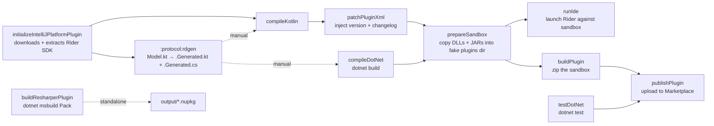
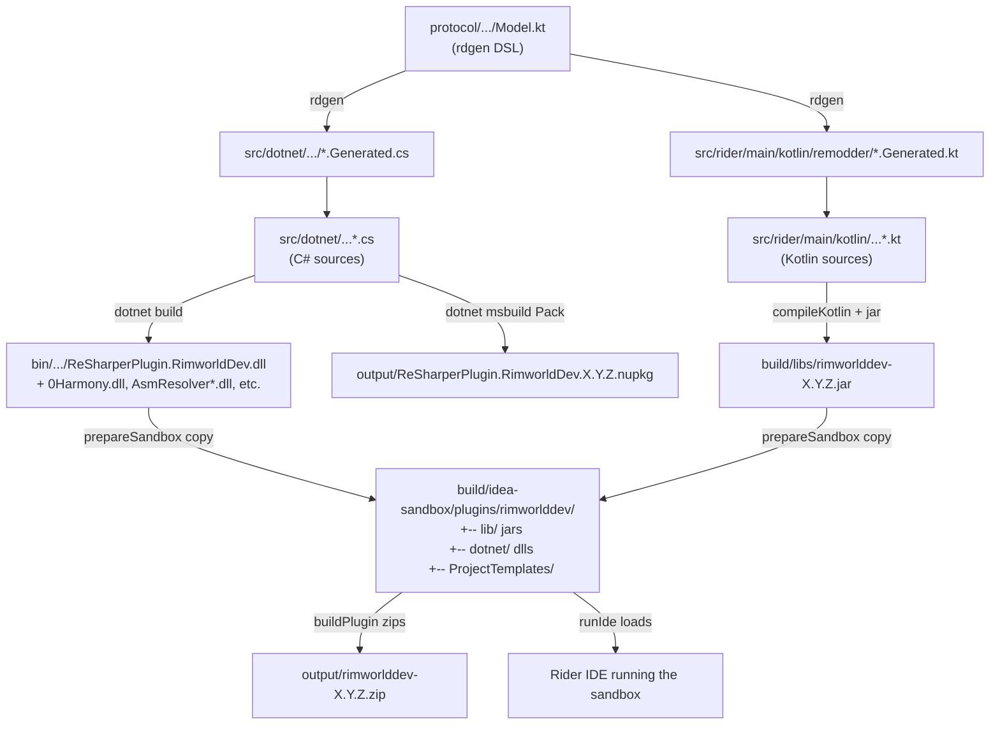
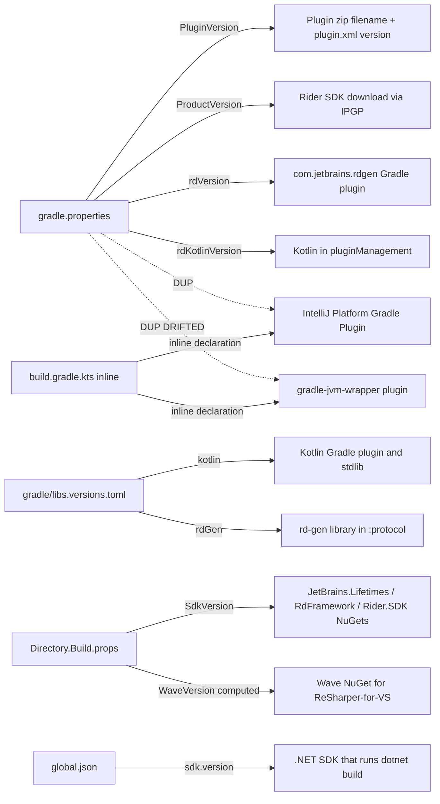
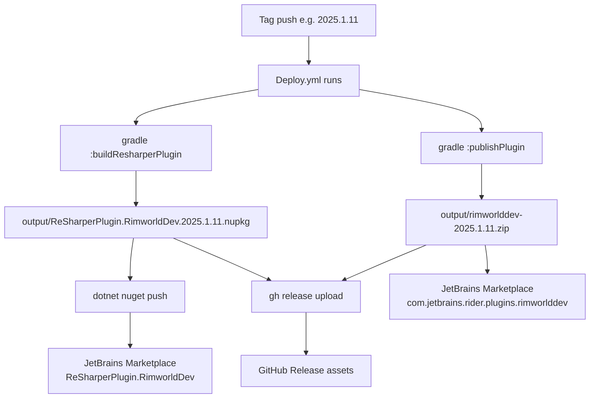

# 20 · Task graph diagrams

**[Reference]** — *Visual reference for how tasks chain together. Cross-reference §09 (annotated build), §14 (prepareSandbox), §16 (CI).*

## Task DAG (the bare essentials)



Notes:
- `rdgen` is shown with dashed `-.manual.-` edges because it's NOT in the build path of `:buildPlugin` / `compileKotlin`. The arrow indicates that *if you run rdgen, the regenerated files become inputs to compileKotlin/compileDotNet.* But the build doesn't trigger rdgen automatically.
- `buildResharperPlugin` is standalone — only invoked when explicitly requested or by `Deploy.yml`.
- `compileDotNet` re-runs every build (no `@OutputFiles` declared). The arrow into `prepareSandbox` is a `dependsOn`, not an incremental input/output relationship.

To verify against your local build:

```bash
./gradlew runIde --dry-run
./gradlew buildPlugin --dry-run
./gradlew publishPlugin --dry-run
```

If the diagram diverges from `--dry-run` output, update the diagram (it's authored at a point in time; reality is the source of truth).

## File flow (where bytes physically move)



## Version-pinning map (which file controls which artifact)



The dashed `DUP` and `DUP DRIFTED` edges mark places where the same property is pinned in two files. §07 has the full table.

## Sandbox layout (what `prepareSandbox` produces)

```
build/idea-sandbox/
├── config/                                   ← IDE settings
├── system/
│   └── log/
│       ├── idea.log                          ← JVM frontend logs
│       └── Rider.Backend/log/                ← .NET backend logs
└── plugins/
    └── rimworlddev/                          ← OUR PLUGIN
        ├── lib/
        │   ├── rimworlddev-X.Y.Z.jar         ← compiled Kotlin
        │   └── (transitive JARs)
        ├── dotnet/                            ← LOAD-BEARING; Rider sweeps this for *.dll
        │   ├── ReSharperPlugin.RimworldDev.dll
        │   ├── ReSharperPlugin.RimworldDev.pdb
        │   ├── 0Harmony.dll
        │   ├── AsmResolver.dll
        │   ├── AsmResolver.DotNet.dll
        │   ├── AsmResolver.PE.dll
        │   ├── AsmResolver.PE.File.dll
        │   └── ICSharpCode.Decompiler.dll
        ├── ProjectTemplates/
        │   └── RimworldProjectTemplate/
        │       └── ...
        └── META-INF/
            └── plugin.xml                     ← patched at build by patchPluginXml
```

## Distribution flow (CI publish)



→ Next: [21 · Contributed tasks table](21-contributed-tasks-table.md)
